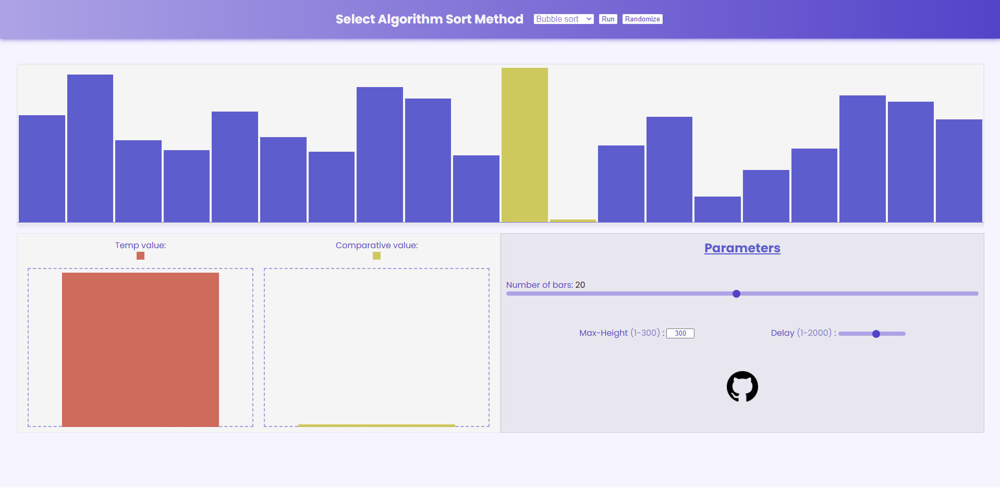
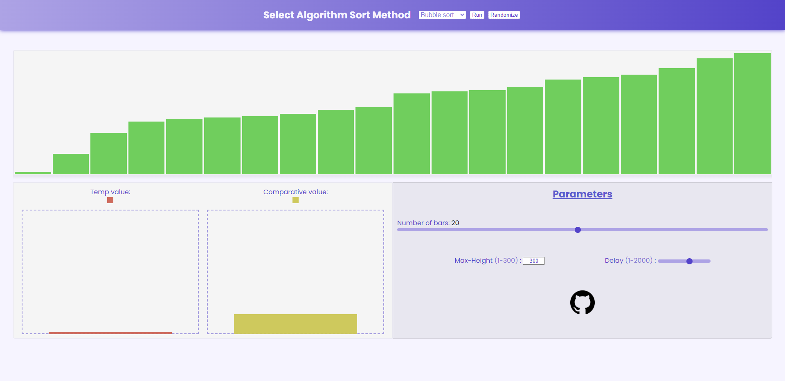

# visual-sort-algorithm

Algoritmo de ordenamiento visualizado con barras. Están implementados <b>Bubble Sort</b> e <b>Insertion Sort</b>, todo el código se implementó desde 0 para el <b>HTML, CSS y JS.</b> <a href="https://alexbgh1.github.io/visual-sort-algorithm/">Visitar página.</a>

Se consideraron parámetros de uso como:

<ul>
  <li><b>Número de barras:</b> 1 - 40</li>
  <li><b>Altura máxima:</b> 1 px - 300 px</li>
  <li><b>Delay:</b> 1 ms - 2000 ms</li>
</ul>

<h2>Aspectos hechos</h2>
<ul>
  <li><b>Responsive</b></li>
  <li><b>Validaciones: input, popup, etc</b></li>
</ul>
<h2>Posibles pendientes</h2>
<ul>
  <li><b>Añadir más algoritmos de ordenamiento</b></li>
  <li><b>Botón de pausa o cancelación</b></li>
</ul>

<h2>Vista previa</h2>

